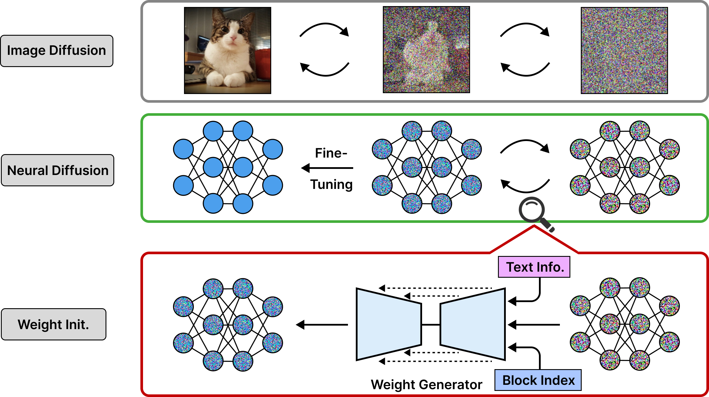

# Efficient Training with Denoised Neural Weights

[Yifan Gong](https://yifanfanfanfan.github.io/)<sup>1,2</sup>, [Zheng Zhan](https://zhanzheng8585.github.io/)<sup>2</sup>, [Yanyu Li](https://scholar.google.com/citations?user=XUj8koUAAAAJ&hl=en)<sup>1,2</sup>, [Yerlan Idelbayev](https://www.linkedin.com/in/yerlan-idelbayev/)<sup>1</sup>,  [Andrey Zharkov](https://www.linkedin.com/in/asmekal/)<sup>1</sup>, [Kfir Aberman](https://kfiraberman.github.io/)<sup>1</sup>, [Sergey Tulyakov](http://www.stulyakov.com/)<sup>1</sup>, [Yanzhi Wang](https://web.northeastern.edu/yanzhiwang/)<sup>2</sup>, [Jian Ren](https://alanspike.github.io/)<sup>1</sup>.  
<sup>1</sup>Snap Inc.&nbsp;&nbsp;&nbsp;&nbsp;&nbsp;<sup>2</sup>Northeastern University&nbsp;&nbsp;&nbsp;&nbsp;  

### [Project](https://github.com/Yifanfanfanfan/Yifanfanfanfan.github.io/tree/main/e2gan) | [Paper](https://snap-research.github.io/HyperHuman/content/hyperhuman.pdf) | [arXiv](https://arxiv.org/abs/2310.08579) | [Demo](https://www.youtube.com/watch?v=uGFWVT_qm9Q)

Good weight initialization serves as an effective measure to reduce the training cost of a deep neural network (DNN) model. The choice of how to initialize parameters is challenging and may require manual tuning, which can be time-consuming and prone to human error. To overcome such limitations, this work takes a novel step towards building a weight generator to synthesize the neural weights for initialization. We use the image-to-image translation task with generative adversarial networks (GANs) as an example due to the ease of collecting model weights spanning a wide range. Specifically, we first collect a dataset with various image editing concepts and their corresponding trained weights, which are later used for the training of the weight generator. To address the different characteristics among layers and the substantial number of weights to be predicted, we divide the weights into equal-sized blocks and assign each block an index. Subsequently, a diffusion model is trained with such a dataset using both text conditions of the concept and the block indexes. By initializing the image translation model with the denoised weights predicted by our diffusion model, the training requires only 43.3 seconds. Compared to training from scratch (i.e., Pix2pix), we achieve a 15× training time acceleration for a new concept while obtaining even better image generation quality.



## Citation

If you find our work useful, please kindly cite as:
```
@article{gong20242,
  title={Efficient Training with Denoised Neural Weights},
  author={Gong, Yifan and Zhan, Zheng and Li, Yanyu and Idelbayev, Yerlan and Zharkov, Andrey and Aberman, Kfir and Tulyakov, Sergey and Wang, Yanzhi and others},
  journal={arXiv preprint arXiv:2401.06127},
  year={2024}
}
```
